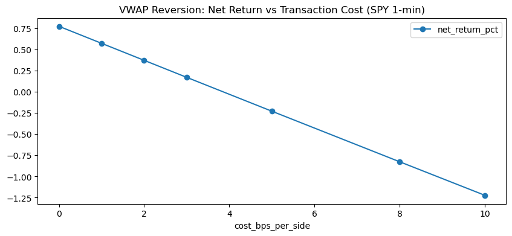

## Phase 2: Intraday Module ("HFT-Style")

Extended the framework to 1-minute bars (SPY) with a session-VWAP
mean reversion strategy, lookahead-free execution (1-bar signal lag),
and per-side transaction costs.

### Key result: cost sensitivity
- Gross (zero-cost) performance: **+0.77%, Sharpe ~9.9** over 5 sessions
- At 5bps/side: **−0.23%, Sharpe −2.7**
- **Break-even cost ≈ 4bps per side (~8bps round trip)**

### Findings
1. A real intraday edge exists but is smaller than realistic retail
   trading costs — the strategy is only viable with sub-4bps execution
   (maker/limit orders, fee rebates, colocation — the HFT cost arsenal)
2. Smaller entry thresholds = more trades = monotonically worse net
   performance (3bp threshold: Sharpe −15)
3. This empirically explains why HFT profitability is an *engineering*
   problem (cost minimization) as much as a signal problem

